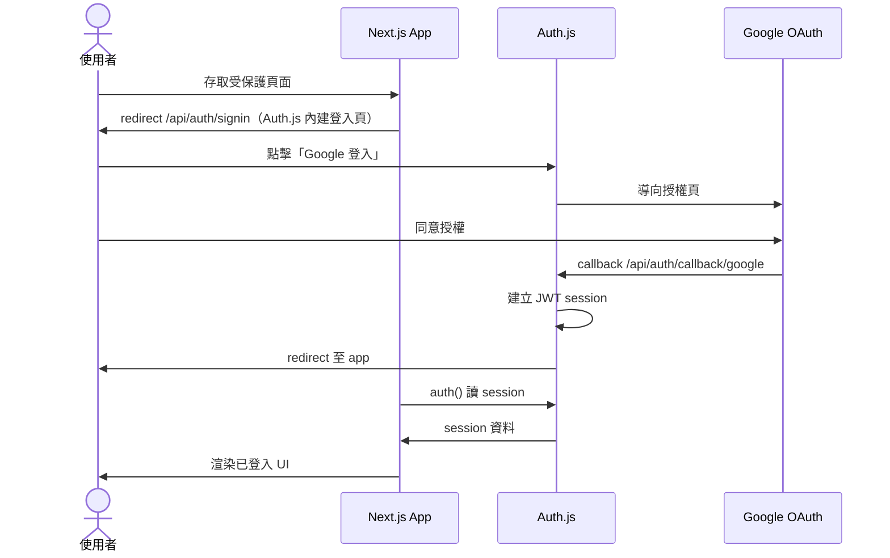
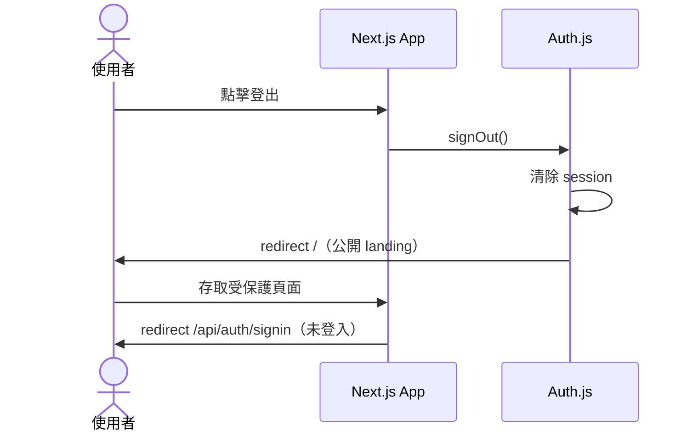

# Google SSO 產品與技術總覽

> **文件版本：** 0.8（草稿，待 review）
> **最後更新：** 2026-08-21

---

## 1. 背景與目標

### 為什麼要做

使用者需透過 **Google 帳號** 登入 Mentorship Exchange 平台。

### 成功長什麼樣（使用者視角）

1. 未登入使用者進入需驗證的頁面 → 被導向登入頁
2. 點擊「使用 Google 登入」→ 跳轉 Google 授權頁
3. 授權完成 → 回到產品，顯示已登入狀態
4. 可正常登出，登出後無法存取受保護頁面

---

## 2. 核心概念（名詞、用途、哪個階段用到）

Google SSO 會牽涉 **Google 雲端後台設定** 與 **產品程式整合** 兩部分。下表用白話說明各名詞，並標示在整體流程的哪個階段會用到。

### 2.1 整體分兩塊

```
┌─────────────────────────────────────────────────────────────┐
│  Phase 1：Google Cloud Console 設定（不需寫程式）              │
│  → 讓 Google 知道「這是誰的 app、登入完可以導回哪些網址」        │
├─────────────────────────────────────────────────────────────┤
│  Phase 2：產品程式整合 Auth.js（RD 實作）                      │
│  → 讓網站真的出現登入按鈕、處理登入狀態、保護頁面               │
└─────────────────────────────────────────────────────────────┘
```

### 2.2 名詞對照表

| 名詞 | 白話說明 | 在哪裡設定 | 使用階段 | 主要給誰用 |
|------|----------|------------|----------|------------|
| **GCP 專案** | Google Cloud 上的一個「專案容器」，OAuth 相關設定都掛在這裡 | [Google Cloud Console](https://console.cloud.google.com/) | Phase 1 | 管理者（如社群 Google 帳號） |
| **OAuth Consent Screen** | 使用者點「Google 登入」時，Google 跳出的**授權說明頁**設定（app 名稱、要存取哪些資料等） | Console → OAuth consent screen | Phase 1 | **使用者**登入時會看到 |
| **使用者支援信箱**（User support email） | 授權頁上顯示的「有問題請聯絡誰」 | Consent Screen 表單欄位 | Phase 1 | **使用者**看；不是放進 env |
| **開發者聯絡信箱**（Developer contact email） | Google 有事要通知開發團隊時用的信箱 | Consent Screen 表單欄位 | Phase 1 | **Google** 聯絡用；使用者通常看不到 |
| **OAuth Client** | 一組「app 登入通行證」設定，包含 Client ID、Client Secret、允許的 redirect URI | Console → Credentials | Phase 1 | 管理者建立；RD 使用 |
| **Client ID** | 公開的 app 識別碼，程式需要用它向 Google 發起登入 | OAuth Client 建立後產生 | Phase 1 → 2 | RD 放進 env（`AUTH_GOOGLE_ID`） |
| **Client Secret** | 私密金鑰，證明 app 真的是你們的 server | OAuth Client 建立後產生 | Phase 1 → 2 | RD 放進 env（`AUTH_GOOGLE_SECRET`），**不可 commit** |
| **Session 金鑰**（`AUTH_SECRET`） | Auth.js 用來簽章 session cookie 的隨機字串。**與 Google 無關**，Google 不知道它存在 | 自行產生（`pnpm dlx auth secret`） | Phase 2 | RD **各自產生**；每人、每環境各一組，不需交接 |
| **Redirect URI** | Google 登入完成後，**允許導回產品的網址**（必須事先登記，填錯就登入失敗） | OAuth Client 表單欄位 | Phase 1；staging/prod 網域出來後追加 | Google 拿來比對；管理者設定 |
| **Test users** | Testing 模式下，**只有名單內的 Gmail 能登入**（用來內部試） | Consent Screen | Phase 1 POC、Phase 3 驗收 | 測試者（可用個人 Gmail，不必是管理者帳號） |
| **環境變數（env）** | 程式讀取的設定檔，例如 Client ID、Client Secret、Session 金鑰、網站網址 | 本機 `.env.local`；上線後部署平台 | Phase 2 起 | RD |
| **Auth.js** | Next.js 用的登入函式庫，負責跟 Google 交握、管理 session | 產品原始碼 | Phase 2 | RD |

### 2.3 管理者 vs 測試登入：兩種 Google 帳號別搞混

| 角色 | 用哪個 Google 帳號 | 做什麼 |
|------|-------------------|--------|
| **GCP 管理者** | 社群專用 Google 帳號：`thementorshiptaiwan@gmail.com` | 登入 Cloud Console，建立專案與 OAuth 設定 |
| **測試登入的使用者** | 任何 Gmail（例如 Tech Lead 個人帳號） | 在產品裡點「Google 登入」試流程 |

> 用社群帳號**建立**憑證，用個人 Gmail**測試登入**，兩者可以不同，也經常這樣做。

### 2.4 OAuth Client 策略（決策說明）

**OAuth Client** = 在 Google Console 建立的一組憑證（Client ID + Client Secret + 允許的 redirect URI）。

| 策略 | 做法 |
|------|------|
| **A. 一組 client** | 同一組 Client ID / Client Secret，redirect URI 填 dev + prod |
| **B. 各環境各一組** | dev、prod 各建一組 client，各自獨立的 Client Secret |

**現階段建議：** 先建**一組** OAuth client，redirect URI **至少先加 localhost**；prod 網域確定後再追加 URI，不必一次填完。

---

## 3. 範圍

### In Scope（本階段要做）

- Google OAuth 2.0 登入
- Auth.js session 管理（登入 / 登出）
- Server Component 讀取 session
- 基本路由保護（未登入 redirect）
- 支援 dev 環境；prod 待網域就緒後啟用

### 本階段 vs 下一階段

| | 本階段（01～04 文件） | 下一階段（學員 onboarding） |
|--|----------------------|---------------------------|
| **目標** | Google 能登入、session 能運作 | 學員白名單、建檔、隱私政策、申訴 |
| **RD 工作** | Auth.js + OAuth 整合 | 白名單邏輯、DB、產品流程頁 |
| **建議** | **先做**，驗收後再開下一階段 | 獨立 spec，不與 SSO 憑證混在一起 |

---

## 4. 環境一覽

### Redirect URI 是什麼？

使用者 Google 登入完成後，瀏覽器會被導向一個**固定的產品網址**，那就是 redirect URI。
Google 只允許導向**事先在 OAuth Client 登記過**的網址。

Auth.js 使用的 path 固定為：

```
{Base URL}/api/auth/callback/google
```

| 環境 | Base URL | Redirect URI（完整） | 狀態 |
|------|----------|---------------------|------|
| **Dev（本機）** | `http://localhost:3000` | `http://localhost:3000/api/auth/callback/google` | ✅ 已確定，**現在就能設定** |
| **Production** | `https://app.<TBD>` | `https://app.<TBD>/api/auth/callback/google` | ⏳ 網域確定後追加 |

環境 URL 需求詳見文件 04。

### 決策待辦
- [ ] Production 正式網域命名（`app.` 前綴 or 根網域）
- [ ] OAuth client 策略：一組 or 各環境各一組（見 §2.4）

---

## 5. 帳號與資源歸屬

| 項目 | 負責方 | 用途說明 | 使用階段 | 設定位置 |
|------|--------|----------|----------|----------|
| GCP 專案 Owner | `thementorshiptaiwan@gmail.com`（社群專用帳號） | 在 Google Cloud 建立專案，作為 OAuth 設定的容器 | Phase 1 | Google Cloud Console |
| Consent Screen 使用者支援信箱 |`thementorshiptaiwan@gmail.com` | 登入授權頁顯示給使用者的聯絡信箱 | Phase 1 | Console → OAuth consent screen |
| Consent Screen 開發者聯絡信箱 | ⏳ 待回 Console 確認 | Google 通知開發團隊用（審核、政策等） | Phase 1 | Console → OAuth consent screen |
| Client ID / Secret 保管 | 目前僅存於本機 `.env.local` | 機密；Console 建立後不再顯示，遺失只能重新產生 | Phase 1 建立 → Phase 2 使用 | Console 建立；RD 放 env |
| Auth.js 程式實作 | RD | 登入按鈕、session、路由保護 | Phase 2 | 產品原始碼 |
| DNS / 部署 | Infra | 提供 prod 的 Base URL | Phase 1 後段～Phase 3 | 部署平台、DNS |

> **待補充：**
> - **開發者聯絡信箱**——Google 發政策、審核、API 異動通知用。建議填官方 + RD 兩個以上，單一收件人有漏信和被停用的風險。
> - **GCP 專案 Owner 帳號**——目前依「支援信箱下拉選單只列出登入帳號本人或其 Google Group」推定為 `thementorshiptaiwan@gmail.com`。

---

## 6. 技術架構

### 技術棧

| 項目 | 選型 |
|------|------|
| Framework | Next.js 16.3.0（App Router） |
| Auth | Auth.js v5（`next-auth@beta`，目前為 `5.0.0-beta.32`） |
| Package Manager | pnpm |
| OAuth Provider | Google |

### OAuth 技術層流程（本階段）



### 登出流程



### 各層職責

| 層級 | 實作方式 | 說明 |
|------|----------|------|
| OAuth callback | Route Handler | `app/api/auth/[...nextauth]/route.ts` |
| Session 讀取 | Server Component | `auth()` |
| 登入觸發 | Auth.js 內建登入頁 | `/api/auth/signin`，未自訂登入頁（⏭️ 下一階段改為自訂 `/login`，見下） |
| 登出觸發 | Server Action | `signOut({ redirectTo: "/" })` |
| 路由保護 | Proxy（`src/proxy.ts`，Next 16 取代 middleware） | 未登入 redirect 至 `/api/auth/signin?callbackUrl=...` |

> **⏭️ 下一階段：自訂登入頁 `/login`。** 條款同意的勾選框必須放在登入頁上（2026-08-21 會議決議，見 [05](./05-login-and-consent-flow.md) §3），Auth.js 內建頁無法承載，因此上述所有 `/api/auth/signin` 的 redirect 目標都會改為 `/login`。實作細節見 [03](./03-authjs-implementation-spec.md) §5.1、§5.3。

---

## 7. Google OAuth Scopes

本階段僅向 Google 請求基本身份資訊（會顯示在 Consent Screen 授權頁上）：

| Scope | 用途 |
|-------|------|
| `openid` | OpenID Connect 標準登入 |
| `email` | 使用者 email |
| `profile` | 使用者名稱、頭像 |

---

## 8. 工作拆分（Task 概覽）

### Phase 0 — 決策（Tech Lead）

- [ ] P0-1 確認 prod URL（或標記 TBD + 命名慣例）
- [x] P0-2 確認 GCP 專案與社群 Google 帳號歸屬 — `thementorshiptaiwan@gmail.com`
- [x] P0-3 確認 OAuth client 策略（見 §2.4

### Phase 1 — Google Cloud 設定（GCP 設定者，不需寫程式）

- [x] P1-1 建立 GCP 專案
- [x] P1-2 設定 OAuth Consent Screen（app 名稱、支援信箱、scopes）
- [x] P1-3 建立 OAuth Web Client，設定 dev redirect URI
- [ ] P1-4 交接 **Google Client Secret**（`AUTH_GOOGLE_SECRET`）給 RD — 目前僅存於本機
- [ ] P1-5 prod URI 待網域就緒後追加

→ 操作細節：文件 02

### Phase 2 — Auth.js 整合（RD）

- [x] P2-1 安裝 Auth.js + 建立設定檔
- [] P2-2 設定 env（Client ID、Secret、AUTH_URL）；prod 待網域確定
- [x] P2-3 登入 / 登出 UI
- [x] P2-4 Server Component session 讀取
- [x] P2-5 Protected routes
- [ ] P2-6 錯誤處理

→ 實作細節：文件 03

### Phase 3 — 驗收（SSO 基礎）

- [ ] P3-1 Dev 環境 E2E 登入成功
- [ ] P3-2 Staging E2E（待 URL）
- [ ] P3-3 Production smoke test（待 URL）

### 下一階段 — 學員 onboarding（獨立規劃，非本批 scope）

- 學員 email 白名單、首次建檔、隱私政策、申訴流程
- 條款版本更新後的重新同意（`terms_version` 比對，見文件 05 §6）

---

## 9. 驗收標準（Acceptance Criteria）

### Scenario：Dev 環境 Google 登入成功

**Given** OAuth 憑證已建立且 dev redirect URI 已設定
**And** Auth.js 整合已完成
**When** 使用者在本機點擊「Google 登入」並完成授權
**Then** 使用者被導回 app 且顯示已登入狀態
**And** refresh 頁面後仍維持登入
**And** 登出後無法存取受保護頁面

### Scenario：Staging / Production 登入成功

**Given** 對應環境的 redirect URI 已加入 Google Console
**And** 該環境 `AUTH_URL` 設定正確
**When** 使用者在該環境完成 Google 登入
**Then** 登入流程與 dev 環境行為一致

---

## 10. 個人驗證（Tech Lead POC）

在 RD 正式實作前，Tech Lead 可自行驗證 **Phase 1 文件是否正確**：

1. 用**社群 Google 帳號**依文件 02 建立 OAuth client（dev only）
2. 若 App 仍在 Testing 模式，將**個人 Gmail** 加為 test user
3. 設定 `.env.local`（見 03 spec 環境變數）
4. 用最小 Auth.js spike 或等 RD 完成 P2-1 後，以**個人 Gmail** 在本機試登入
5. 本機登入成功 → Runbook 與 redirect URI 設定正確

> POC 成功代表 **憑證與文件 OK**；完整 SSO 驗收仍需 Phase 2 完成。

---

## 11. 修訂紀錄

| 版本 | 日期 | 變更 |
|------|------|------|
| 0.1 | 2026-08-13 | 初稿，dev URI 確定；staging/prod TBD |
| 0.2 | 2026-08-13 | 流程圖改為 Mermaid sequence diagram |
| 0.3 | 2026-08-13 | 新增核心概念章節；帳號歸屬與環境表補充白話說明 |
| 0.4 | 2026-08-13 | 區分本階段 SSO vs 下一階段 onboarding |
| 0.5 | 2026-08-13 | 移除適合對象、適合時機；精簡交叉引用 |
| 0.6 | 2026-08-16 | 依實作校正：登入頁為 Auth.js 內建 `/api/auth/signin`（無自訂 `/login`）；登出導回 `/`；§6 技術棧版本與 Proxy 更新；修正檔頭版本號（原停在 0.3） |
| 0.7 | 2026-08-17 | 回填 Console 與程式碼實況：GCP Owner 與支援信箱定案為 `thementorshiptaiwan@gmail.com`、app 名稱 Mentorship Exchange；環境簡化為 dev / prod（移除 staging）；§2.2 新增 `AUTH_SECRET` 詞條並統一「Client Secret」命名以與其區隔；結案 P0-2、P0-3、P1-1～P1-3、P2-1～P2-5。未結案：開發者聯絡信箱、P1-4 交接、P2-6 錯誤處理 |
| 0.8 | 2026-08-21 | §6 各層職責補注：下一階段改用自訂登入頁 `/login`（條款勾選框需放在登入頁，2026-08-21 會議決議），所有 `/api/auth/signin` 的 redirect 目標將隨之改變 |
