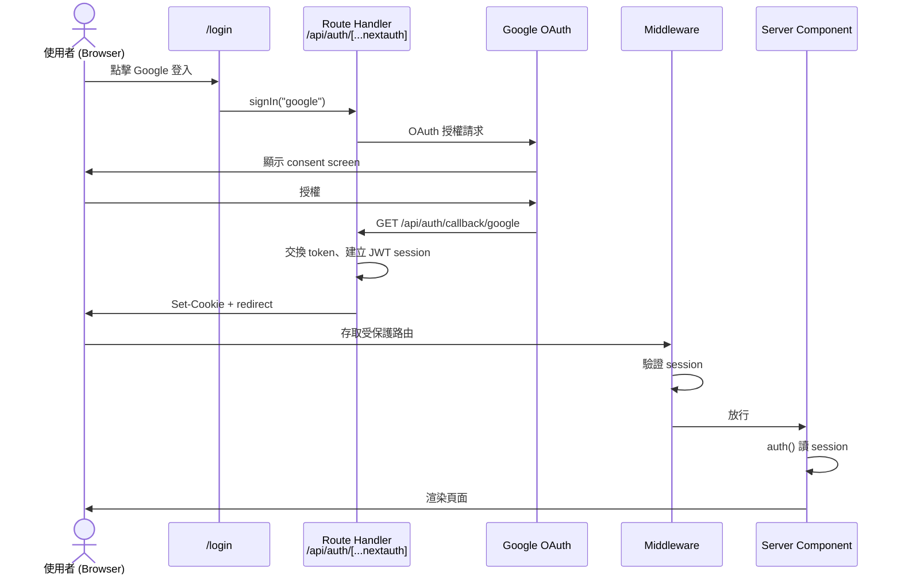

# Auth.js 工程實作規格

> **文件版本：** 0.4（草稿，待 review）
> **對象：** RD
> **使用階段：** Phase 2（需 Phase 1 的 Client ID / Secret）
> **前置：** OAuth 憑證已建立（文件 02）

---

## 1. 技術選型

| 項目 | 版本 / 選型 |
|------|-------------|
| Framework | Next.js 16.3.0（App Router） |
| Auth Library | Auth.js v5（npm package: `next-auth@5`） |
| Package Manager | pnpm |
| OAuth Provider | Google |
| Node.js | ≥ 20.9 |

---

## 2. 環境變數

### 必要變數

| 變數 | 說明 | Dev 範例 |
|------|------|----------|
| `AUTH_SECRET` | Session 加密金鑰 | 執行 `openssl rand -base64 32` 產生 |
| `AUTH_URL` | 該環境的 base URL（**不含** trailing slash） | `http://localhost:3000` |
| `AUTH_GOOGLE_ID` | Google OAuth Client ID | 來自 Runbook 交接 |
| `AUTH_GOOGLE_SECRET` | Google OAuth Client Secret | 來自 Runbook 交接 |

### `.env.local` 範例（dev，勿 commit）

```bash
AUTH_SECRET=<openssl rand -base64 32 的結果>
AUTH_URL=http://localhost:3000
AUTH_GOOGLE_ID=<Client ID>
AUTH_GOOGLE_SECRET=<Client Secret>
```

### 各環境 AUTH_URL 對照

| 環境 | AUTH_URL | 狀態 |
|------|----------|------|
| Dev | `http://localhost:3000` | ✅ |
| Staging | `https://staging.<TBD>` | ⏳ |
| Production | `https://app.<TBD>` | ⏳ |

> `AUTH_URL` 必須與使用者實際存取 app 的 URL 一致，否則 OAuth callback 會失敗。

---

## 3. 相依套件

```bash
pnpm add next-auth@5
```

> 安裝後請確認 `next-auth` 版本與 Next.js 16.2 相容。若 peer dependency 警告，依官方文件處理。

---

## 4. 預期檔案結構

```
src/
├── auth.ts                              # Auth.js 設定（providers、callbacks）
├── middleware.ts                        # 路由保護（或 Next 16 proxy 慣例）
└── app/
    ├── api/
    │   └── auth/
    │       └── [...nextauth]/
    │           └── route.ts             # Auth.js Route Handler
    ├── login/
    │   └── page.tsx                     # 登入頁
    └── (protected)/                     # 需登入的路由群組（範例）
        └── home/
            └── page.tsx                 # 登入後首頁
```

> 實際路由命名可依產品調整，但 **`/api/auth/[...nextauth]`** 為 Auth.js 預設路徑，對應 Google redirect URI 中的 `/api/auth/callback/google`。

---

## 5. 核心實作要点

建議依下列順序開發，每步完成後可局部驗收：

```
1. auth.ts          → Auth 設定（providers、匯出 auth / handlers）
2. Route Handler    → 掛上 /api/auth/*，OAuth callback 能跑
3. Middleware       → 定義哪些路由需登入（未登入 redirect）
4. 登入頁 /login    → Google 登入按鈕
5. 首頁 /home       → 登入後 landing，顯示 session 資料
6. 登出             → signOut，驗證 session 清除
```

> **為什麼 Middleware 放在頁面之前？** 先定義「誰能進 `/home`」，再實作頁面，可避免首頁漏保護或登入後 redirect 目標不一致。若 Middleware 整合有問題，可暫時只在 layout / page 用 `auth()` + `redirect()`，待 OAuth 跑通後再補 Middleware。

### 5.1 `src/auth.ts`

- 設定 Google Provider
- 匯出 `handlers`、`auth`、`signIn`、`signOut`
- 可選：callbacks 自訂 session 內容（例如注入 `user.id`）

```typescript
// 結構示意，實作時依 Auth.js v5 官方文件為準
import NextAuth from "next-auth";
import Google from "next-auth/providers/google";

export const { handlers, auth, signIn, signOut } = NextAuth({
  providers: [
    Google({
      clientId: process.env.AUTH_GOOGLE_ID,
      clientSecret: process.env.AUTH_GOOGLE_SECRET,
    }),
  ],
});
```

### 5.2 `src/app/api/auth/[...nextauth]/route.ts`

```typescript
import { handlers } from "@/auth";

export const { GET, POST } = handlers;
```

### 5.3 路由保護（Middleware）

在 `src/middleware.ts` 保護需登入的路徑：

```typescript
// 結構示意
export { auth as middleware } from "@/auth";

export const config = {
  matcher: ["/home/:path*"],
};
```

> Next.js 16 可能有 `proxy.ts` 慣例演進，實作時請對照專案 Next 版本文件。若 middleware 與 Auth.js 整合有問題，可改在 layout 層用 `auth()` + `redirect()`。

### 5.4 登入頁 `src/app/login/page.tsx`

- **Client Component**（登入按鈕需 `onClick`）
- 提供「使用 Google 登入」按鈕
- 觸發 `signIn("google", { redirectTo: "/home" })`

```typescript
// Client Component 示意
"use client";
import { signIn } from "next-auth/react";

export default function LoginPage() {
  return (
    <button onClick={() => signIn("google", { redirectTo: "/home" })}>
      使用 Google 登入
    </button>
  );
}
```

### 5.5 登入後首頁 `src/app/(protected)/home/page.tsx`

- **Server Component**（用 `auth()` 讀 session）
- Middleware 已負責未登入 redirect；此處 `auth()` 主要用於取得 `name` / `email` 渲染 UI
- 可保留 `if (!session) redirect("/login")` 作為雙重保護

```typescript
import { auth } from "@/auth";
import { redirect } from "next/navigation";

export default async function HomePage() {
  const session = await auth();
  if (!session) redirect("/login");

  return <div>Hello, {session.user?.name}</div>;
}
```

### 5.6 登出

```typescript
import { signOut } from "@/auth";

// Server Action 或 Client 觸發
await signOut({ redirectTo: "/login" });
```

---

## 6. OAuth 流程



### 各層職責

| 步驟 | 執行位置 | 類型 |
|------|----------|------|
| 使用者點登入 | Login Page | Client / Server Action |
| 導向 Google | Auth.js | Route Handler |
| Google callback | `/api/auth/callback/google` | Route Handler |
| 建立 session | Auth.js | Server |
| 頁面讀 session | 任意 Server Component | Server Component |
| 攔截未登入 | Middleware / Layout | Middleware |

---

## 7. Session 策略

使用 Auth.js 預設的 **JWT session**，不需額外資料庫設定。

---

## 8. 登入後取得的使用者資料

Google Provider 預設提供：

| 欄位 | 來源 |
|------|------|
| `session.user.email` | Google account email |
| `session.user.name` | Google display name |
| `session.user.image` | Google profile picture |

若需額外欄位，在 `callbacks.jwt` / `callbacks.session` 擴充。

---

## 9. 錯誤處理

| 情境 | 預期行為 |
|------|----------|
| OAuth 授權被拒 | 導回 login 頁，顯示友善錯誤訊息 |
| env 變數缺失 | dev 環境 console 明確報錯 |
| session 過期 | 視為未登入，redirect 至 login |
| Google API 異常 | 顯示通用錯誤，log 詳細資訊 |

建議新增 `src/app/login/page.tsx` 讀取 query param `?error=...` 顯示錯誤（Auth.js 支援 `pages.error` 或 callback 處理）。

---

## 10. 路由一覽（階段 A）

| 路徑 | 需登入 | 說明 |
|------|--------|------|
| `/login` | ❌ | 登入頁 |
| `/home` | ✅ | **登入後首頁**；OAuth 成功後 redirect 目標 |
| `/` | ⏳ TBD | 可 redirect 至 `/login` 或 `/home`，依產品決定 |

未登入存取 `/home` → redirect 至 `/login`。

---

## 11. RD 驗收 Checklist

### Dev 環境

- [ ] `pnpm dev` 可正常啟動
- [ ] `/login` 頁面顯示 Google 登入按鈕
- [ ] 點擊登入 → 跳轉 Google → 授權後回到 app
- [ ] 登入後可看到使用者 name / email
- [ ] refresh 頁面後 session 仍在
- [ ] 登出後 session 清除
- [ ] 登出後無法進入受保護頁面（被 redirect）
- [ ] env 變數未 commit 至 git

### Staging / Production（待 URL）

- [ ] 對應 redirect URI 已加入 Google Console
- [ ] 部署環境 `AUTH_URL` 設定正確
- [ ] HTTPS 環境登入成功

---

## 12. 參考資源

- [Auth.js 官方文件](https://authjs.dev/)
- [Auth.js Google Provider](https://authjs.dev/getting-started/providers/google)
- [Auth.js Next.js 整合](https://authjs.dev/getting-started/installation?framework=next.js)

---

## 13. 修訂紀錄

| 版本 | 日期 | 變更 |
|------|------|------|
| 0.1 | 2026-08-13 | 初稿 |
| 0.2 | 2026-08-13 | 補充使用階段與名詞交叉引用 |
| 0.3 | 2026-08-13 | 登入後 landing 改為 `/home`（首頁）；精簡階段 A 路由表 |
| 0.4 | 2026-08-13 | §5 依建議開發順序重排；Middleware 提前；標註 Client / Server 分工 |
