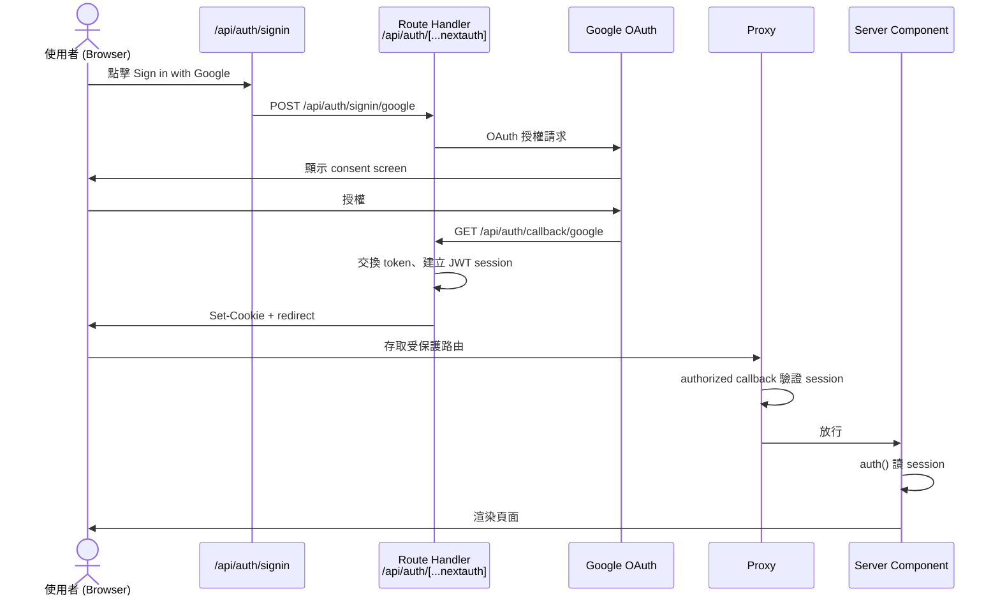

# Auth.js 工程實作規格

> **文件版本：** 0.7（草稿，待 review）
> **對象：** RD
> **使用階段：** Phase 2（需 Phase 1 的 Client ID / Secret）
> **前置：** OAuth 憑證已建立（文件 02）

---

## 1. 技術選型

| 項目 | 版本 / 選型 |
|------|-------------|
| Framework | Next.js 16.3.0（App Router） |
| Auth Library | Auth.js v5（npm package: `next-auth@beta`，目前為 `5.0.0-beta.32`） |
| Package Manager | pnpm |
| OAuth Provider | Google |
| Node.js | ≥ 20.9 |

---

## 2. 環境變數

### 必要變數

| 變數 | 說明 | Dev 範例 |
|------|------|----------|
| `AUTH_SECRET` | Session 加密金鑰。**v5 唯一真正必要的變數** | `pnpm dlx auth secret` 或 `openssl rand -base64 33` 產生 |
| `AUTH_URL` | 該環境的 base URL（**不含** trailing slash） | `http://localhost:3000` |
| `AUTH_GOOGLE_ID` | Google OAuth Client ID | 來自 Runbook 交接 |
| `AUTH_GOOGLE_SECRET` | Google OAuth Client Secret | 來自 Runbook 交接 |

> **v5 的變數推斷機制：** Auth.js v5 會自動讀取 `AUTH_{PROVIDER}_{ID|SECRET}` 格式的變數作為對應 provider 的 `clientId` / `clientSecret`，**程式碼中不需也不應手動傳入**（見 §5.1）。
>
> `AUTH_URL` 在 v5 已非必要 — host 會從 request header 自動推斷。仍建議在 dev 明確設定以免誤判。
> 部署在反向代理／PaaS 後方時，需額外設定 `AUTH_TRUST_HOST=true`，讓 Auth.js 信任 `X-Forwarded-Host` / `X-Forwarded-Proto`。

### `.env.local` 範例（dev，勿 commit）

```bash
AUTH_SECRET=<openssl rand -base64 32 的結果>
AUTH_URL=http://localhost:3000
AUTH_GOOGLE_ID=<Client ID>
AUTH_GOOGLE_SECRET=<Client Secret>
```

### 各環境 AUTH_URL 對照

| 環境 | AUTH_URL | 狀態 |
|------|----------|------|
| Dev | `http://localhost:3000` | ✅ |
| Production | `https://app.<TBD>` | ⏳ |

> `AUTH_URL` 必須與使用者實際存取 app 的 URL 一致，否則 OAuth callback 會失敗。

---

## 3. 相依套件

```bash
pnpm add next-auth@beta
```

> Auth.js v5 尚未 stable release，npm 的 `latest` tag 仍是 v4（API 完全不同），因此**必須**用 `@beta`。
> beta 版在 `package.json` 中會鎖定精確版本（如 `5.0.0-beta.32`）而非 caret range，避免自動跳版。
>
> 已驗證 peer dependency 相容 Next.js 16.3.0 / React 19.2.8，安裝時無警告。

---

## 4. 預期檔案結構

```
src/
├── auth.ts                              # Auth.js 設定（providers、callbacks）
├── proxy.ts                             # 路由保護（Next 16 慣例，取代 middleware.ts）
└── app/
    ├── page.tsx                         # 公開 landing（見 §10）
    ├── api/
    │   └── auth/
    │       └── [...nextauth]/
    │           └── route.ts             # Auth.js Route Handler
    └── (protected)/                     # 需登入的路由群組（範例）
        └── home/
            └── page.tsx                 # 登入後首頁
```

> 實際路由命名可依產品調整，但 **`/api/auth/[...nextauth]`** 為 Auth.js 預設路徑，對應 Google redirect URI 中的 `/api/auth/callback/google`。

---

## 5. 核心實作要点

建議依下列順序開發，每步完成後可局部驗收：

```
1. auth.ts          → Auth 設定（providers、匯出 auth / handlers、authorized callback）
2. Route Handler    → 掛上 /api/auth/*，OAuth callback 能跑
3. Proxy            → 定義哪些路由需登入（未登入 redirect）
4. 首頁 /home       → 登入後 landing，顯示 session 資料
5. 登出             → signOut，驗證 session 清除
```

> **為什麼 Proxy 放在頁面之前？** 先定義「誰能進 `/home`」，再實作頁面，可避免首頁漏保護或登入後 redirect 目標不一致。若 Proxy 整合有問題，可暫時只在 layout / page 用 `auth()` + `redirect()`，待 OAuth 跑通後再補。

### 5.1 `src/auth.ts`

- 設定 Google Provider
- 設定 `callbacks.authorized` — **這是 Proxy 阻擋的必要條件**（見 §5.3）
- 匯出 `handlers`、`auth`、`signIn`、`signOut`

```typescript
// 結構示意，實作時依 Auth.js v5 官方文件為準
import NextAuth from "next-auth";
import Google from "next-auth/providers/google";

export const { handlers, auth, signIn, signOut } = NextAuth({
  providers: [Google],
  callbacks: {
    authorized: ({ auth }) => !!auth?.user,
  },
});
```

**階段 A（現況）：** 不設 `pages`，登入頁與錯誤頁即為 Auth.js 內建的 `/api/auth/signin` 與 `/api/auth/error`。

> **⏭️ 下一階段改為自訂登入頁。** 條款同意的勾選框要放在登入頁上（見 05 §3），內建頁無法放，因此需自建 `/login` 並設定：
>
> ```typescript
> pages: { signIn: "/login" },
> ```
>
> 設定後，`authorized` 回傳 `false` 時 Auth.js 會改導向 `/login?callbackUrl=...`，全站的未登入 redirect 目標一併改變（連帶影響 §5.3、§5.4、§9、§10）。

> **不要手動傳 `clientId` / `clientSecret`。** v5 會自動從 `AUTH_GOOGLE_ID` / `AUTH_GOOGLE_SECRET` 推斷（見 §2）。手動傳入不但多餘，`process.env.X` 的型別是 `string | undefined`，在本專案的 `strict: true` 下會直接 TS 編譯失敗。
>
> Session 使用預設 JWT 策略（§7），不設 adapter。

### 5.2 `src/app/api/auth/[...nextauth]/route.ts`

```typescript
import { handlers } from "@/auth";

export const { GET, POST } = handlers;
```

### 5.3 路由保護（Proxy）

> **Next.js 16 已將 `middleware` 慣例更名為 `proxy`，`middleware.ts` 為 deprecated。**
> 若專案內同時存在 `middleware.ts` 與 `proxy.ts`，`next build` 會直接報錯；只有 `middleware.ts` 則會出 deprecation warning。
> 舊專案可用 `npx @next/codemod@canary middleware-to-proxy .` 自動遷移。

在 `src/proxy.ts`（與 `app/` 同層）保護需登入的路徑：

```typescript
export { auth as proxy } from "@/auth";

export const config = {
  matcher: [
    "/((?!api/auth|_next|$|.*\\.(?:ico|png|jpe?g|gif|svg|webp|txt|xml|webmanifest|json)$).*)",
  ],
};
```

matcher 採 **deny-list（排除清單）**：預設全部路由都需登入，只列出公開的例外。

| 排除項 | 為什麼要公開 |
|--------|--------------|
| `api/auth` | OAuth callback 與內建登入頁，擋了會無限重導 |
| `_next` | 打包後的 CSS / JS（`_next/static`）與圖片最佳化（`_next/image`） |
| `$` | 根路由 `/`（公開 landing，見 §10） |
| `*.副檔名` | favicon、robots.txt、sitemap.xml、manifest 及 `public/` 內的靜態檔案 |
| `login` | ⏭️ **下一階段**：自訂登入頁 `/login`（見 §5.1） |

> **⚠️ 自訂登入頁上線時，`/login` 必須加進排除清單。** 漏掉的話：未登入者進 `/login` → 被 proxy 擋下 → 導向 `/login` → 再被擋下 …… 形成無限重導。matcher 會變成：
>
> ```typescript
> "/((?!api/auth|login|_next|$|.*\\.(?:ico|png|jpe?g|gif|svg|webp|txt|xml|webmanifest|json)$).*)",
> ```

> **匯出名稱必須是 `proxy` 或 default export**，不能是 `middleware`。
>
> **只有這個檔案是不夠的。** `auth` 作為 proxy 時，若 `auth.ts` 沒有 `callbacks.authorized`，它只會把 session 附加到 `req.auth` 而**不會阻擋任何人**。擋人的判斷來自 §5.1 的 `authorized`，回傳 `false` 時 Auth.js 會導向 `/api/auth/signin?callbackUrl=...`。
>
> 若 Proxy 整合有問題，可改在 layout 層用 `auth()` + `redirect()`。

#### ⚠️ `(protected)` 資料夾本身不提供任何保護

`(protected)` 是 **Route Group** — 括號資料夾不會出現在 URL 中，`(protected)/home/page.tsx` 的網址就是 `/home`。它純粹是命名上的分類，**沒有強制力**。實際阻擋的只有 `proxy.ts` 的 matcher。

**因此新增公開路由（例如 `/about`、`/terms`）時，必須補進排除清單**；新增受登入保護的路由則不需要動 matcher。

若要讓資料夾名副其實，可在 `(protected)/layout.tsx` 加一道 `auth()` + `redirect()`。但注意 layout **不會在 client-side 導航時重跑**，所以它是便利的預設防線，不能取代 proxy。防護分三層：

| 層 | 執行時機 |
|---|---|
| `proxy.ts` | 每個 HTTP 請求 |
| `(protected)/layout.tsx` | 群組首次進入 |
| 頁面內的 `auth()` | 每次該頁渲染 |

### 5.4 登入後首頁 `src/app/(protected)/home/page.tsx`

- **Server Component**（用 `auth()` 讀 session）
- Proxy 已負責未登入 redirect；此處 `auth()` 主要用於取得 `name` / `email` 渲染 UI
- 保留 `if (!session?.user) redirect(...)` 作為雙重保護（例如 matcher 改動時漏掉本路由），同時讓 `session.user` 的型別收斂

```typescript
import { auth } from "@/auth";
import { redirect } from "next/navigation";

export default async function HomePage() {
  const session = await auth();
  if (!session?.user) redirect("/api/auth/signin?callbackUrl=%2Fhome");

  return <div>Hello, {session.user.name}</div>;
}
```

> ⏭️ **下一階段**：自訂登入頁上線後，此處的 redirect 目標改為 `/login?callbackUrl=%2Fhome`。

> Google 頭像的子網域**不固定**（`lh3` / `lh4` …），寫死單一個會讓部分使用者的頭像掛掉 — 而且這是**逐使用者**發生、build / typecheck / lint 全都驗不出來的錯誤。`next.config.ts` 應使用單層 wildcard：
>
> ```typescript
> images: {
>   remotePatterns: [
>     { protocol: "https", hostname: "*.googleusercontent.com" },
>   ],
> }
> ```
>
> Next 的 wildcard 語法：`*` 匹配單一子網域，`**` 匹配開頭任意數量子網域。

### 5.5 登出

在 `/home` 內用 Server Action 包 `signOut`，登出後導回首頁 `/`：

```typescript
import { signOut } from "@/auth";

<form
  action={async () => {
    "use server";
    await signOut({ redirectTo: "/" });
  }}
>
  <button type="submit">登出</button>
</form>;
```

---

## 6. OAuth 流程



### 各層職責

| 步驟 | 執行位置 | 類型 |
|------|----------|------|
| 使用者點登入 | 階段 A：Auth.js 內建登入頁 `/api/auth/signin`；⏭️ 下一階段：自訂 `/login` |
| 導向 Google | Auth.js | Route Handler |
| Google callback | `/api/auth/callback/google` | Route Handler |
| 建立 session | Auth.js | Server |
| 頁面讀 session | 任意 Server Component | Server Component |
| 攔截未登入 | `src/proxy.ts` + `authorized` callback | Proxy |

---

## 7. Session 策略

使用 Auth.js 預設的 **JWT session**，不需額外資料庫設定。

---

## 8. 登入後取得的使用者資料

Google Provider 預設提供：

| 欄位 | 來源 |
|------|------|
| `session.user.email` | Google account email |
| `session.user.name` | Google display name |
| `session.user.image` | Google profile picture |

若需額外欄位，在 `callbacks.jwt` / `callbacks.session` 擴充。

---

## 9. 錯誤處理

| 情境 | 預期行為 |
|------|----------|
| OAuth 授權被拒 | 導向 Auth.js 內建錯誤頁，顯示錯誤代碼 |
| env 變數缺失 | dev 環境 console 明確報錯 |
| session 過期 | 視為未登入，redirect 至 `/api/auth/signin`（⏭️ 下一階段改為 `/login`） |
| Google API 異常 | 顯示通用錯誤，log 詳細資訊 |

現行使用 Auth.js 內建的錯誤頁（`/api/auth/error`），錯誤以 `?error=<code>` 傳遞。code 來自 `@auth/core` 的型別定義：

| 來源 | 常見 code |
|------|-----------|
| `SignInPageErrorParam` | `OAuthSignin`、`OAuthCallbackError`、`OAuthAccountNotLinked`、`Callback`、`SessionRequired` |
| `ErrorPageParam` | `Configuration`、`AccessDenied`、`Verification` |

> 內建錯誤頁為英文且無法在地化。若日後需要中文訊息或自訂樣式，須另外建立錯誤頁並在 `auth.ts` 設定 `pages.error` 指向它。

---

## 10. 路由一覽（階段 A）

| 路徑 | 需登入 | 說明 |
|------|--------|------|
| `/api/auth/signin` | ❌ | **登入頁**（Auth.js 內建頁）；⏭️ 下一階段由 `/login` 取代 |
| `/home` | ✅ | **登入後的 app 主體**；顯示身分資訊與登出 |
| `/` | ❌ | 公開的品牌 landing，**不** redirect；只放一個 CTA |
| `/login` | ❌ | ⏭️ **下一階段**：自訂登入頁。Google 登入按鈕 + 條款勾選框 + 條款彈窗；亦承載白名單拒絕狀態（見 05 §3、§9） |


### `/` 與 `/home` 的分工

兩頁若都顯示身分與登出會造成重複。分工固定為：

| | `/` | `/home` |
|---|---|---|
| 定位 | 公開 landing | 登入後的 app 主體 |
| 未登入 | 顯示「登入」CTA（⏭️ 下一階段指向 `/login`） | 進不來（被 proxy 擋下） |
| 已登入 | 只顯示「進入 Home」 | 身分資訊（name / email / 頭像）+ **登出** |

---

## 11. RD 驗收 Checklist

### Dev 環境

- [x] `pnpm dev` 可正常啟動
- [x] `/` 未登入可正常瀏覽，且有指向登入頁的 CTA
- [x] 已登入時 `/` 的 CTA 變為「進入 Home」
- [x] 登入後可看到使用者 name / email / 頭像（**頭像會驗到 §5.4 的 host allowlist**）
- [x] 未登入存取 `/home` → 307 導向 `/api/auth/signin?callbackUrl=...`
- [x] `/api/auth/signin` 顯示 Google 登入按鈕（內建頁）
- [x] OAuth 起手式正確 — POST `/api/auth/signin/google` 回 302，導向
      `accounts.google.com/o/oauth2/v2/auth`，`redirect_uri` 為
      `/api/auth/callback/google`，`scope` 為 `openid profile email`
- [x] env 變數未 commit 至 git
- [x] refresh 頁面後 session 仍在
- [x] 於 Google consent 頁按「取消」→ 顯示錯誤訊息
- [x] 登出後導回首頁 `/`，session 已清除
- [x] 登出後無法進入受保護頁面（被 redirect）

### Staging / Production（待 URL）

- [ ] 對應 redirect URI 已加入 Google Console
- [ ] 部署環境 `AUTH_URL` 設定正確
- [ ] HTTPS 環境登入成功

### ⏭️ 下一階段：自訂登入頁 `/login`（尚未實作）

- [ ] `auth.ts` 已設定 `pages: { signIn: "/login" }`
- [ ] `/login` 已加入 proxy matcher 排除清單（**未加會無限重導**）
- [ ] 未登入存取 `/home` → 導向 `/login?callbackUrl=...`，非 `/api/auth/signin`
- [ ] `/` 的 CTA 指向 `/login`
- [ ] `/login` 未勾選同意時，Google 登入按鈕不可按
- [ ] 條款彈窗可開啟，關閉後不影響勾選狀態
- [ ] 登入成功後 `callbackUrl` 仍正確帶回原本要去的頁面

> Google Console 的 redirect URI **不受影響**——OAuth callback 仍是 `/api/auth/callback/google`，自訂的只是登入畫面。

---

## 12. 參考資源

- [Auth.js 官方文件](https://authjs.dev/)
- [Auth.js Google Provider](https://authjs.dev/getting-started/providers/google)
- [Auth.js Next.js 整合](https://authjs.dev/getting-started/installation?framework=next.js)

---

## 13. 修訂紀錄

| 版本 | 日期 | 變更 |
|------|------|------|
| 0.1 | 2026-08-13 | 初稿 |
| 0.2 | 2026-08-13 | 補充使用階段與名詞交叉引用 |
| 0.3 | 2026-08-13 | 登入後 landing 改為 `/home`（首頁）；精簡階段 A 路由表 |
| 0.4 | 2026-08-13 | §5 依建議開發順序重排；Middleware 提前；標註 Client / Server 分工 |
| 0.5 | 2026-08-16 | 依實作結果校正：Middleware → Next 16 `proxy.ts`；§5.1 移除手動 clientId/secret 並補 `authorized` callback；§2 補 v5 env 推斷與 `AUTH_TRUST_HOST`；§9 補實際 error code；§10 定案 `/` 為公開首頁 |
| 0.6 | 2026-08-16 | §5.3 matcher 改為 deny-list（排除清單）並改寫維護規則；§5.4 未登入 redirect 改指 `/api/auth/signin` 並說明 `callbackUrl`；§6 登入頁改為 Auth.js 內建頁；修正 §11 env 數量與 §5.4 交叉引用 |
| 0.7 | 2026-08-21 | 標注下一階段改用自訂登入頁 `/login`（條款勾選框需放在登入頁，見 05 v0.8）：§5.1 `pages.signIn`、§5.3 matcher 須排除 `/login` 並警告無限重導、§5.4 / §6 / §9 / §10 redirect 目標、§11 新增下一階段 checklist。階段 A 現況與已驗收項目維持不變 |
