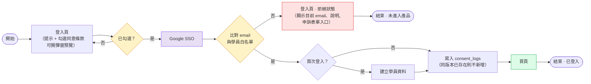
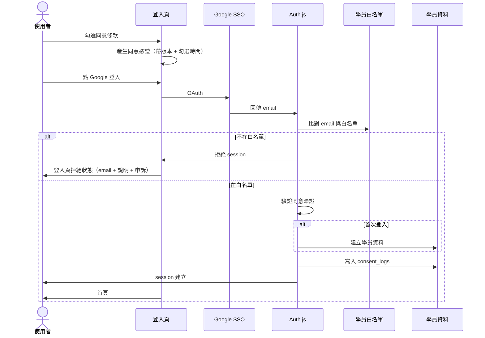

# First-Timer 登入流程（產品層）

> **文件版本：** 0.9
> **對象：** PM / RD
> **使用階段：** 下一階段規劃，不在目前 SSO 基礎建設（01～04）的實作範圍內
> **前置：** 階段 A Google SSO 與 Auth.js 整合已完成
> **決策依據：** 條款同意採「登入頁勾選」（2026-08-21 會議決議，比較過程見 [`05a-consent-placement-decision.md`](./05a-consent-placement-decision.md)）

---

## 1. 文件目的

描述 **首次使用者** 從登入頁到進入首頁的完整產品流程，包含：

- 登入頁顯示提示：請使用報名 email 登入 Google
- 登入頁勾選同意條款（互惠條款 + 隱私政策），條款以彈窗預覽
- Google SSO
- 比對 email 與學員白名單
- 首次登入：建立學員資料，並寫入同意紀錄
- 既有使用者：條款版本更新後需重新同意（§6）
- 不在白名單：登入頁拒絕狀態（含申訴入口）

---

## 2. 與 Google Console Test Users 的差別

| | Google Test users | 學員 email 白名單 |
|--|-------------------|-------------------|
| **設在哪** | Google Cloud Console | 產品資料庫 / 後台 |
| **目的** | 開發階段讓 OAuth 能跑 | 產品規則：只有報名學員能用 |
| **使用階段** | Phase 1 POC | 本文件（下一階段） |
| **上線後** | 切 Production 後可不用 | 持續需要 |

兩者可能同時存在（RD 本機測 OAuth 時），但互不取代。

---

## 3. First-Timer 流程圖

> 條款版本更新後的重新同意**不走這條流程**（使用者持有 session、不會經過登入頁），見 §6。

---

## 4. 各步驟說明

| 步驟 | 負責 | 使用階段 | 說明 |
|------|------|----------|------|
| 登入頁（含提示文案） | RD / PM | 下一階段 | 自訂登入頁 `/login`；顯示 Google 登入按鈕、提示使用報名 email |
| 勾選同意條款 | RD / PM | 下一階段 | 未勾選時 Google 登入按鈕不可按；條款以彈窗預覽（按鈕為「我知道了」，同意動作在勾選框） |
| 產生同意憑證 | RD | 下一階段 | 勾選後由 server 產生 signed cookie / OAuth `state`，帶著版本與勾選時間跨過 redirect（見 §7） |
| Google SSO | Auth.js | 階段 A | 取得 `email`、`name` 等 |
| 比對 email 與學員白名單 | RD | 下一階段 | Google 回傳 email 之後，查 DB / 名單 |
| 登入頁 · 拒絕狀態 | RD / PM | 下一階段 | 同一登入頁：顯示目前 email、說明文案、申訴表單入口 |
| 驗證同意憑證 | RD | 下一階段 | callback 端驗證憑證，沒有憑證不建立 session（見 §7） |
| 建立學員資料 | RD | 下一階段 | 僅首次需要建檔。**須先於 `consent_logs`**（見下一列） |
| 寫入 `consent_logs` | RD | 下一階段 | 含 `terms_version` + `privacy_version` + `agreed_at`。`consent_logs.user_id` 外鍵指向 `users.id`，首次登入必須先建檔才寫得進去。寫入規則見 §8 |
| 條款版本比對 | RD | 下一階段 | **每次請求**比對 token 內版本與目前上線版本，不符則攔截（見 §6，非僅登入時檢查）。**⏳ 機制待確認** |
| 條款重簽頁（改版後） | RD / PM | 下一階段 | 版本不符時攔下來重新同意；內容與登入頁條款彈窗相同，可共用元件（見 §6）。**⏳ 機制待確認** |

---

## 5. 技術層時序（白名單檢查發生在哪）

---

## 6. 條款版本更新後的重新同意

> **⏳ 本節機制待確認。**「條款改版要重新同意」已確認要做（有對應卡片），但**下方的實作機制**（每次請求檢查、版本號放進 token、proxy 攔截）尚未與其他夥伴確認，開工前需一起 review。

### 6.1 目標

當互惠條款或隱私條款內容更新時，確保已同意舊版本的學員會被要求重新確認新版本，避免同意紀錄與實際條款內容脫節。

### 6.2 需求

**功能需求**

- 比對使用者最新一筆 `consent_logs.terms_version` 是否等於目前上線的條款版本
- 版本不符時，強制導向條款同意頁，流程比照首次同意
- 版本相符時，直接放行至首頁列表
- 重新同意後**新增**一筆 `consent_logs`，保留舊紀錄

**非功能需求**

- 條款版本號需有明確管理機制（如遞增版本號或條款最後更新日期），避免人工更新時版本判斷錯誤

### 6.2.1 重簽頁出現的時機（⏳ 待確認）

四個條件同時成立時才會出現，**每人每次改版只出現一次**，簽完即不再攔截：

1. 條款已改版
2. 使用者仍持有有效 session（未登出、未過期）
3. 其最新同意版本為舊版
4. 正要進入受保護頁面

不會看到的人：新使用者、以及剛好重新登入的人——他們在登入頁就已勾選最新版。

### 6.3 ⚠️ 「登入時檢查」不足以達成目標

原始 story 寫「於使用者**下次登入時**檢查」。在目前架構下這個攔截點會漏掉大部分人：

| 事實 | 出處 |
|------|------|
| session 為 JWT，未掛 DB adapter | `src/auth.ts`；文件 06 §3 |
| Auth.js JWT 預設有效期 30 天 | Auth.js v5 預設值 |
| 已持有有效 JWT 的使用者不會再經過登入流程 | — |

結果：條款在 v1→v2 更新後，**既有使用者最多可再用 30 天舊版同意繼續操作**——正好是這個 story 要防的落差。

**登入頁的勾選框補不了這個洞**，因為那些人不會經過登入頁。

**建議改為「每次請求檢查」，且不需要每次查 DB（⏳ 待確認）：**

1. 在 Auth.js `jwt` callback 把使用者最新的 `terms_version` 寫進 token
2. 在 `src/proxy.ts` 比對 token 內的版本與目前上線版本常數
3. 不符 → redirect 至條款同意頁；相符 → 放行
4. 使用者重新同意後，寫入 `consent_logs` 並更新 token 內的版本

版本常數放在程式碼／環境變數而非 DB，比對就不需要 DB round-trip，逐請求檢查的成本可接受。

> ⚠️ 第 4 步的「更新 token」不可省略。否則使用者簽完後 token 內仍是舊版，下一個請求會再次被攔，形成迴圈。

> 「條款改版後需重新同意」**已確認要做**（已有對應卡片）。但上述四步驟只是建議實作方式，**⏳ 待與其他夥伴確認後再定案**。

### 6.4 驗收 Checklist

前提：測試帳號上次同意的 `terms_version` 為 v1，平台已上線 v2 條款。

**版本不符時要擋下來**

- [ ] 存取任一受保護頁面時被導向條款同意頁（**不限於重新登入**，帶著既有 session 直接進站也要被攔）
- [ ] 未重新同意前無法進入首頁列表
- [ ] 同意後可正常進入首頁，且不再被攔截

**同意紀錄要正確累積**

- [ ] 重新同意後新增一筆 `terms_version` 為 v2 的 `consent_logs`
- [ ] 舊的 v1 紀錄仍存在（未被覆寫或刪除）

**不可誤攔**

- [ ] 已同意 v2 的使用者不受影響，直接放行
- [ ] 首次登入的新使用者仍走原本的首次同意流程

---

## 7. 勾選狀態如何跨過 OAuth

使用者一離開登入頁去 Google，前端的勾選狀態就消失了。callback 回來時必須有依據，才能證明他同意過、也才知道他同意的是哪個版本。

- **勾選當下由 server 產生憑證** — signed cookie 或 OAuth `state`，內容至少包含：當下顯示的 `terms_version`、`privacy_version`、勾選時間
- **callback 端驗證憑證才寫入** — 不能只信前端的 checkbox。畫面上的按鈕禁用可以被繞過（直接呼叫 signin endpoint），沒有憑證就不應建立 session
- **版本 pin 在勾選當下** — 避免流程進行中條款上線新版，結果記錄到使用者沒看過的版本
- **`agreed_at` 用勾選時間**（記在憑證裡），而非 callback 寫入時間

> 若採 popup / 新分頁開 OAuth，登入頁不會被卸載、前端狀態自然還在；但 server 端仍需上述憑證才能寫入 `consent_logs`。

### 7.1 憑證遺失時怎麼辦（⏳ 待決策）

使用者清 cookie、換裝置、或隔太久才回來時，OAuth 會成功但手上沒有同意證明。兩個方向：

| 選項 | 優點 | 缺點 |
|------|------|------|
| 退回登入頁重勾 | 安全、單純 | 使用者會覺得「我明明勾了」 |
| 導向條款頁補簽 | 體驗較順，且該頁本來就要做（§6） | 多一個入口要接 |

**尚未決議，開工前需確認。**

---

## 8. `consent_logs` 寫入規則

現有 schema（[`src/db/schema.ts`](../../src/db/schema.ts)）不需要新增欄位：

| 欄位 | 放什麼 |
|------|--------|
| `user_id` | OAuth callback 後才拿得到；**建檔後才寫得進去**（外鍵） |
| `terms_version` | 勾選當下顯示的版本 |
| `privacy_version` | 同上。**兩個獨立版本號，勾一次寫兩個** |
| `agreed_at` | 勾選的時間點（此欄無 DB 預設值，本來就由程式帶入） |

憑證是暫時的 cookie / `state`，不進 DB。

### 8.1 同版本不重複新增

`consent_logs` 有 unique index `uq_consent_user_versions`（`user_id` + `terms_version` + `privacy_version`），代表 **一個人 × 一組版本 = 一筆**。登入 100 次、條款沒改版 → 仍是 1 筆；條款 v1 → v2 才變 2 筆。

因為「每次登入都要勾」會重複觸發寫入，實作時須採 `onConflictDoNothing`，否則第二次登入會違反唯一性。`agreed_at` 因此保留**第一次**同意該版本的時間——法務上這個語意是正確的。

> 若日後要求「每次登入都留下紀錄」，那是**登入紀錄**不是同意紀錄，`users.last_login_at` 已在記錄；真要逐次留存需另開表，不建議動 `consent_logs` 的 unique index。

### 8.2 白名單被拒者不留同意紀錄

他勾選了但沒有 `user_id`，什麼都不會寫入。這是預期行為，不是 bug：他未進入產品。

---

## 9. 登入頁 · 拒絕狀態文案（草案）

> 你目前以 **xxx@gmail.com** 登入。
> 若報名時使用的是其他信箱，請聯繫管理員，或填寫申訴表單。

---

## 10. 待決策（下一階段開工前）

- [ ] 白名單資料從哪來？（後台上傳、報名系統匯入、試算表…）
- [ ] 誰維護白名單？
- [ ] 學員資料要存哪些欄位？
- [ ] **憑證遺失時的 fallback**（見 §7.1）
- [x] ~~條款同意頁僅首次顯示，或每次版本更新時再顯示？~~ → **已確認：版本更新時也要重新同意**（見 §6）
- [ ] 申訴表單接哪裡？（Google Form、後台 ticket…）

### 條款版本相關（§6，需 PM 確認）

- [ ] **重簽的實作機制**（每次請求檢查／版本號放 token／proxy 攔截）——⏳ 待與其他夥伴確認，見 §6
- [ ] 條款版本號格式與管理機制（遞增整數？語意化版本？條款最後更新日期？存哪裡？）
- [ ] 預計更新頻率——決定攔截機制要做多即時
- [x] ~~互惠條款與隱私政策是否共用同一個 `terms_version`~~ → **已確認：schema 為兩個獨立欄位**（`terms_version` / `privacy_version`）
- [ ] 條款更新後，未重新同意的使用者是否完全擋住，或允許唯讀瀏覽
- [x] ~~本 story 是否排入 v1 開發範圍~~ → **已確認要做**

---

## 11. 修訂紀錄

| 版本 | 日期 | 變更 |
|------|------|------|
| 0.1 | 2026-08-13 | 初稿 |
| 0.2 | 2026-08-13 | 流程圖改為由左至右；調整文件語氣 |
| 0.3 | 2026-08-13 | 提示文案併入登入頁節點 |
| 0.4 | 2026-08-13 | 白名單節點文案；拒絕流程合併為同一登入頁；首次登入先同意隱私政策再建檔 |
| 0.5 | 2026-08-17 | 新增 §6 條款版本更新後的重新同意（會議新增的 user story）；流程圖加入版本比對與 `consent_logs` 節點；標注「登入時檢查」在 JWT session 下的漏洞與建議做法；§8 補條款版本待決策 |
| 0.6 | 2026-08-21 | 修正建檔與 `consent_logs` 的先後順序：`consent_logs.user_id` 外鍵指向 `users.id`，首次登入須先建檔再寫同意紀錄（§3 流程圖、§4 步驟表） |
| 0.7 | 2026-08-21 | §6 條款改版重簽確認納入開發（原待決策項改為已決）；新增 §6.2.1 重簽頁出現時機；§4 補「條款重簽頁」步驟並修正版本比對為逐請求檢查 |
| 0.8 | 2026-08-21 | **依會議決議改為「登入頁勾選同意」**：§3 流程圖、§4 步驟表、§5 時序圖全面更新；新增 §7 勾選狀態跨 OAuth（含 §7.1 fallback 待決策）與 §8 `consent_logs` 寫入規則；§10 更新待決策 |
| 0.9 | 2026-08-21 | §6 重簽的**實作機制**標為待確認（做不做已定案，機制待與夥伴 review）：§4 步驟表、§6 節首、§6.2.1、§6.3 加註記；§10 補追蹤項 |
