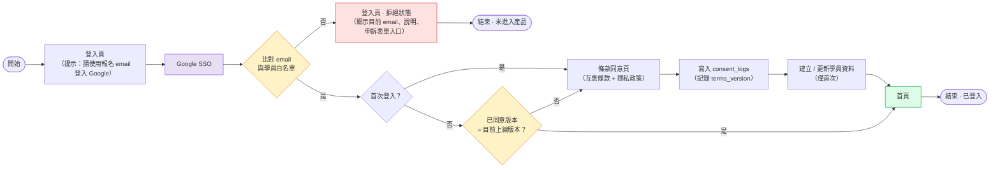
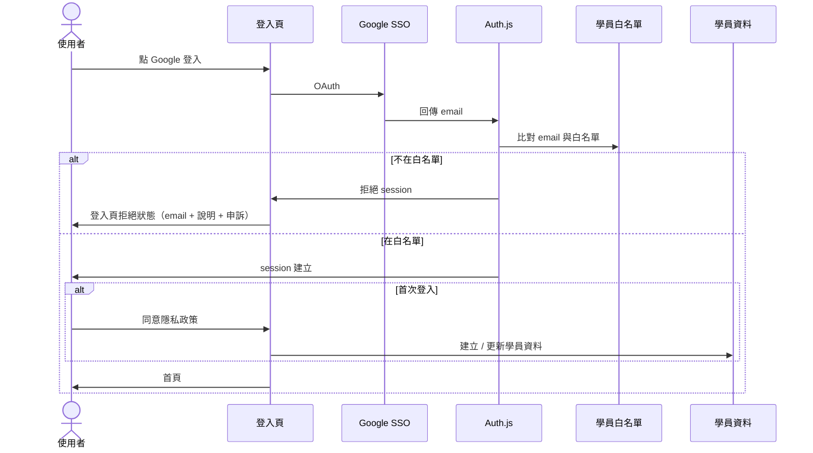

# First-Timer 登入流程（產品層）

> **文件版本：** 0.5
> **對象：** PM / RD
> **使用階段：** 下一階段規劃，不在目前 SSO 基礎建設（01～04）的實作範圍內
> **前置：** 階段 A Google SSO 與 Auth.js 整合已完成

---

## 1. 文件目的

描述 **首次使用者** 從登入頁到進入首頁的完整產品流程，包含：

- 登入頁顯示提示：請使用報名 email 登入 Google
- Google SSO
- 比對 email 與學員白名單
- 首次登入：同意條款（互惠條款 + 隱私政策）後建立學員資料
- 既有使用者：條款版本更新後需重新同意
- 不在白名單：登入頁拒絕狀態（含申訴入口）

---

## 2. 與 Google Console Test Users 的差別

| | Google Test users | 學員 email 白名單 |
|--|-------------------|-------------------|
| **設在哪** | Google Cloud Console | 產品資料庫 / 後台 |
| **目的** | 開發階段讓 OAuth 能跑 | 產品規則：只有報名學員能用 |
| **使用階段** | Phase 1 POC | 本文件（下一階段） |
| **上線後** | 切 Production 後可不用 | 持續需要 |

兩者可能同時存在（RD 本機測 OAuth 時），但互不取代。

---

## 3. First-Timer 流程圖

---

## 4. 各步驟說明

| 步驟 | 負責 | 使用階段 | 說明 |
|------|------|----------|------|
| 登入頁（含提示文案） | RD / PM | 下一階段 | 顯示 Google 登入按鈕；提示使用報名 email |
| Google SSO | Auth.js | 階段 A | 取得 `email`、`name` 等 |
| 比對 email 與學員白名單 | RD | 下一階段 | Google 回傳 email 之後，查 DB / 名單 |
| 登入頁 · 拒絕狀態 | RD / PM | 下一階段 | 同一登入頁：顯示目前 email、說明文案、申訴表單入口 |
| 條款同意頁（首次） | RD / PM | 下一階段 | 白名單通過且首次登入時，須先同意互惠條款 + 隱私政策 |
| 條款版本比對 | RD | 下一階段 | 非首次登入者，比對最新同意版本與目前上線版本（見 §6） |
| 寫入 `consent_logs` | RD | 下一階段 | 每次同意都**新增一筆**（含 `terms_version`），不覆寫舊紀錄 |
| 建立 / 更新學員資料 | RD | 下一階段 | 同意條款後寫入；僅首次需要建檔 |

---

## 5. 技術層時序（白名單檢查發生在哪）

---

## 6. 條款版本更新後的重新同意

### 6.1 目標

當互惠條款或隱私條款內容更新時，確保已同意舊版本的學員會被要求重新確認新版本，避免同意紀錄與實際條款內容脫節。

### 6.2 需求

**功能需求**

- 比對使用者最新一筆 `consent_logs.terms_version` 是否等於目前上線的條款版本
- 版本不符時，強制導向條款同意頁，流程比照首次同意
- 版本相符時，直接放行至首頁列表
- 重新同意後**新增**一筆 `consent_logs`，保留舊紀錄

**非功能需求**

- 條款版本號需有明確管理機制（如遞增版本號），避免人工更新時版本判斷錯誤

### 6.3 ⚠️ 「登入時檢查」不足以達成目標

原始 story 寫「於使用者**下次登入時**檢查」。在目前架構下這個攔截點會漏掉大部分人：

| 事實 | 出處 |
|------|------|
| session 為 JWT，未掛 DB adapter | `src/auth.ts`；文件 06 §3 |
| Auth.js JWT 預設有效期 30 天 | Auth.js v5 預設值 |
| 已持有有效 JWT 的使用者不會再經過登入流程 | — |

結果：條款在 v1→v2 更新後，**既有使用者最多可再用 30 天舊版同意繼續操作**——正好是這個 story 要防的落差。

**建議改為「每次請求檢查」，且不需要每次查 DB：**

1. 在 Auth.js `jwt` callback 把使用者最新的 `terms_version` 寫進 token
2. 在 `src/proxy.ts`比對 token 內的版本與目前上線版本常數
3. 不符 → redirect 至條款同意頁；相符 → 放行
4. 使用者重新同意後，寫入 `consent_logs` 並更新 token 內的版本

版本常數放在程式碼／環境變數而非 DB，比對就不需要 DB round-trip，逐請求檢查的成本可接受。

> 此為技術建議，非 PRD 決議。是否採用需 RD 與 PM 一起確認。

### 6.4 驗收 Checklist

前提：測試帳號上次同意的 `terms_version` 為 v1，平台已上線 v2 條款。

**版本不符時要擋下來**

- [ ] 存取任一受保護頁面時被導向條款同意頁（**不限於重新登入**，帶著既有 session 直接進站也要被攔）
- [ ] 未重新同意前無法進入首頁列表
- [ ] 同意後可正常進入首頁，且不再被攔截

**同意紀錄要正確累積**

- [ ] 重新同意後新增一筆 `terms_version` 為 v2 的 `consent_logs`
- [ ] 舊的 v1 紀錄仍存在（未被覆寫或刪除）

**不可誤攔**

- [ ] 已同意 v2 的使用者不受影響，直接放行
- [ ] 首次登入的新使用者仍走原本的首次同意流程

---

## 7. 登入頁 · 拒絕狀態文案（草案）

> 你目前以 **xxx@gmail.com** 登入。
> 若報名時使用的是其他信箱，請聯繫管理員，或填寫申訴表單。

---

## 8. 待決策（下一階段開工前）

- [ ] 白名單資料從哪來？（後台上傳、報名系統匯入、試算表…）
- [ ] 誰維護白名單？
- [ ] 學員資料要存哪些欄位？
- [ ] 條款同意頁僅首次顯示，或每次版本更新時再顯示？（§6 假設為後者）
- [ ] 申訴表單接哪裡？（Google Form、後台 ticket…）

### 條款版本相關（§6，需 PM 確認）

- [ ] 條款版本號格式與管理機制（遞增整數？語意化版本？存哪裡？）
- [ ] 預計更新頻率——決定攔截機制要做多即時
- [ ] 互惠條款與隱私政策是否共用同一個 `terms_version`，或各自獨立版本
- [ ] 條款更新後，未重新同意的使用者是否完全擋住，或允許唯讀瀏覽
- [ ] 本 story 是否排入 v1 開發範圍

---

## 9. 修訂紀錄

| 版本 | 日期 | 變更 |
|------|------|------|
| 0.1 | 2026-08-13 | 初稿 |
| 0.2 | 2026-08-13 | 流程圖改為由左至右；調整文件語氣 |
| 0.3 | 2026-08-13 | 提示文案併入登入頁節點 |
| 0.4 | 2026-08-13 | 白名單節點文案；拒絕流程合併為同一登入頁；首次登入先同意隱私政策再建檔 |
| 0.5 | 2026-08-17 | 新增 §6 條款版本更新後的重新同意（會議新增的 user story）；流程圖加入版本比對與 `consent_logs` 節點；標注「登入時檢查」在 JWT session 下的漏洞與建議做法；§8 補條款版本待決策 |
