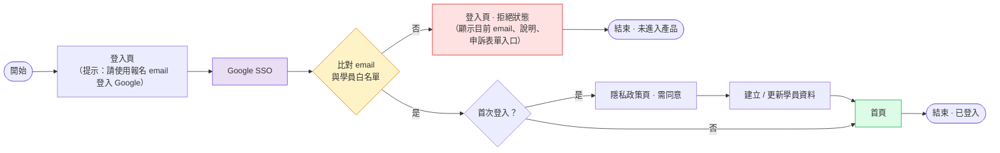
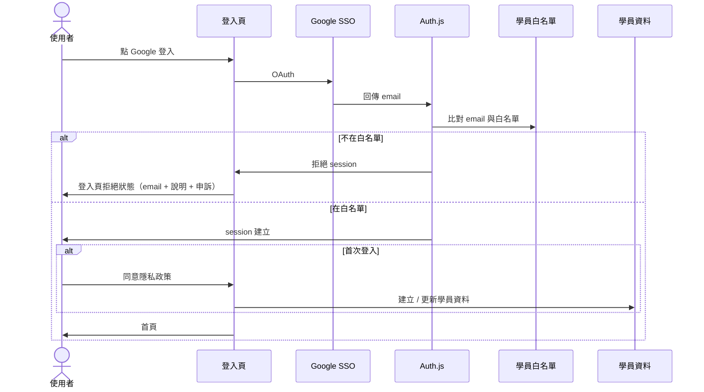

# First-Timer 登入流程（產品層）

> **文件版本：** 0.4  
> **狀態：** 下一階段規劃，不在目前 SSO 基礎建設（01～04）的實作範圍內  
> **前置條件：** 階段 A Google SSO 與 Auth.js 整合已完成

---

## 1. 文件目的

描述 **首次使用者** 從登入頁到進入首頁的完整產品流程，包含：

- 登入頁顯示提示：請使用報名 email 登入 Google
- Google SSO
- 比對 email 與學員白名單
- 首次登入：同意隱私政策後建立學員資料
- 不在白名單：登入頁拒絕狀態（含申訴入口）

---

## 2. 與 Google Console Test Users 的差別

| | Google Test users | 學員 email 白名單 |
|--|-------------------|-------------------|
| **設在哪** | Google Cloud Console | 產品資料庫 / 後台 |
| **目的** | 開發階段讓 OAuth 能跑 | 產品規則：只有報名學員能用 |
| **使用階段** | Phase 1 POC | 本文件（下一階段） |
| **上線後** | 切 Production 後可不用 | 持續需要 |

兩者可能同時存在（RD 本機測 OAuth 時），但互不取代。

---

## 3. First-Timer 流程圖

---

## 4. 各步驟說明

| 步驟 | 負責 | 使用階段 | 說明 |
|------|------|----------|------|
| 登入頁（含提示文案） | RD / PM | 下一階段 | 顯示 Google 登入按鈕；提示使用報名 email |
| Google SSO | Auth.js | 階段 A | 取得 `email`、`name` 等 |
| 比對 email 與學員白名單 | RD | 下一階段 | Google 回傳 email 之後，查 DB / 名單 |
| 登入頁 · 拒絕狀態 | RD / PM | 下一階段 | 同一登入頁：顯示目前 email、說明文案、申訴表單入口 |
| 隱私政策（首次） | RD / PM | 下一階段 | 白名單通過且首次登入時，須先同意 |
| 建立 / 更新學員資料 | RD | 下一階段 | 同意隱私政策後寫入 |

---

## 5. 技術層時序（白名單檢查發生在哪）

---

## 6. 登入頁 · 拒絕狀態文案（草案）

> 你目前以 **xxx@gmail.com** 登入。  
> 若報名時使用的是其他信箱，請聯繫管理員，或填寫申訴表單。

---

## 7. 待決策（下一階段開工前）

- [ ] 白名單資料從哪來？（後台上傳、報名系統匯入、試算表…）
- [ ] 誰維護白名單？
- [ ] 學員資料要存哪些欄位？
- [ ] 隱私政策是否每次登入都顯示，或僅首次？
- [ ] 申訴表單接哪裡？（Google Form、後台 ticket…）

---

## 8. 修訂紀錄

| 版本 | 日期 | 變更 |
|------|------|------|
| 0.1 | 2026-08-13 | 初稿 |
| 0.2 | 2026-08-13 | 流程圖改為由左至右；調整文件語氣 |
| 0.3 | 2026-08-13 | 提示文案併入登入頁節點 |
| 0.4 | 2026-08-13 | 白名單節點文案；拒絕流程合併為同一登入頁；首次登入先同意隱私政策再建檔 |
