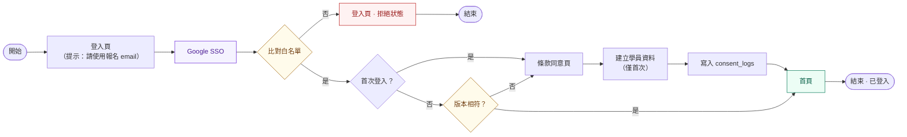
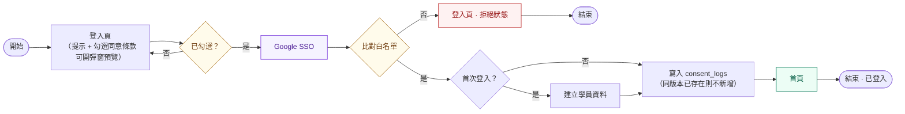

# 條款同意位置：兩案比較（決策紀錄）

> ## ✅ 已結案
>
> **2026-08-21 會議決議：採用案 B（登入頁勾選同意）。**
> 實作規格已併入 [`05-login-and-consent-flow.md`](./05-login-and-consent-flow.md) v0.8，請以該文件為準。
> 本文件保留為決策紀錄，說明當初為何這樣選，內容不再更新。

> **文件版本：** 1.1
> **對象：** PM / RD / Designer
> **相關文件：** [`05-login-and-consent-flow.md`](./05-login-and-consent-flow.md)（正式規格）、[`03-authjs-implementation-spec.md`](./03-authjs-implementation-spec.md)（自訂登入頁實作）
> **目的：** 記錄 consent 放在登入頁（案 B）與放在 OAuth 之後（案 A）的比較，以及過程中發現的一處文件與 DB 不一致

---

## 1. 這份文件要討論兩件事

### 1-1. 一處文件與 DB 對不上（已修正，僅需知會）

**不是 DB 設計錯，是流程文件的寫入順序跟 DB 對不上。**

`consent_logs.user_id` 有外鍵指向 `users.id`（[`src/db/schema.ts`](../../src/db/schema.ts)），但 05 的流程圖畫的是「先寫 `consent_logs` → 再建立學員資料」。首次登入的人 `users` 那列還不存在，照圖實作會直接違反外鍵。

已修正為 **建檔 → 寫同意紀錄**（05 v0.6）。schema 本身不需要改。

### 1-2. consent 的位置，要選一案

UI 目前的設計是**在登入頁就勾選同意**、條款用彈窗預覽——這跟 05 原本規劃的「OAuth 之後才出條款頁」對不上。兩種都可行，需要團隊選一個。

---

## 2. 案 A：OAuth 之後才同意（05 原版）

**特性**

- 同意時已經有 session，`user_id` 就在手上 → 直接寫 DB，沒有跨頁面帶狀態的問題
- 只在「首次」或「條款改版」時出現條款頁，之後登入不再打擾
- 但**與現有 UI 不符**，登入頁的勾選框要拿掉

---

## 3. 案 B：登入頁勾選同意（配合現有 UI）

**特性**

- 與現有 UI 一致，使用者在按 Google 登入前就看得到條款
- 每次重新登入都要勾（但同版本不會重複產生紀錄，見 §6）
- 代價：勾選狀態必須跨過 OAuth redirect（見 §5）

---

## 4. 兩案比較

| | 案 A（OAuth 後同意） | 案 B（登入頁勾選） |
|--|---------------------|-------------------|
| 與現有 UI | ❌ 要改掉登入頁勾選框 | ✅ 直接對上 |
| 使用者何時看到條款 | 登入後、進站前 | 按登入鍵之前 |
| 重新登入 | 版本相符就直接進首頁 | 每次都要勾 |
| 寫入 `consent_logs` | 同頁面內完成，`user_id` 已知 | 要把勾選狀態帶過 redirect |
| 額外程式 | — | 約 20～30 行（種憑證 + 驗憑證） |
| 額外要決策 | — | 憑證遺失時怎麼辦（見 §5） |
| 新增 DB 欄位 | 不用 | 不用 |
| 額外工時 | — | 約 0.5～1 天 |
| 站內重簽頁 | 需要 | 需要（見 §7） |

---

## 5. 案 B 的關鍵技術點：勾選狀態怎麼跨過 OAuth

使用者一離開頁面去 Google，前端的勾選狀態就消失了。callback 回來時必須有依據，才能證明他同意過、也才知道他同意的是哪個版本。

- **勾選當下由 server 產生憑證** — signed cookie 或 OAuth `state`，內容至少包含：當下顯示的 `terms_version`、`privacy_version`、勾選時間
- **callback 端驗證憑證才寫入** — 不能只信前端的 checkbox（直接呼叫 signin endpoint 可以繞過畫面上的按鈕禁用）
- **版本 pin 在勾選當下** — 避免流程進行中條款上線新版，結果記錄到使用者沒看過的版本
- **`agreed_at` 用勾選時間**（記在憑證裡），而非 callback 寫入時間

> 若採 popup / 新分頁開 OAuth，登入頁不會被卸載、前端狀態自然還在；但 server 端仍需上述憑證才能寫入。

**要一起決定的**：憑證遺失時（清 cookie、換裝置、隔太久才回來）怎麼處理？

- 選項 1：擋下來，退回登入頁重勾 → 安全，但使用者會覺得「我明明勾了」
- 選項 2：導向站內條款頁補簽 → 體驗較順，且該頁本來就要做（見 §7）

---

## 6. DB 對照：不用加欄位

`consent_logs` 現有四個欄位剛好夠用：

| 欄位 | 放什麼 |
|------|--------|
| `user_id` | callback 後才拿得到 |
| `terms_version` | 勾選當下顯示的版本 |
| `privacy_version` | 同上（**兩個獨立版本號，勾一次寫兩個**） |
| `agreed_at` | 勾選的時間點（此欄無 DB 預設值，本來就由程式帶入） |

憑證是暫時的 cookie / `state`，不進 DB。

### unique index 的意涵（需確認）

`consent_logs` 有 unique index `uq_consent_user_versions`（`user_id` + `terms_version` + `privacy_version`），代表：

**一個人 × 一組版本 = 一筆。** 登入 100 次、條款沒改版 → 還是 1 筆；條款 v1 → v2 → 才變 2 筆。

這對法務是正確的：要證明的是「這個人同意過這個版本、在什麼時候」，同版本存 100 筆一樣的紀錄沒有額外證明力。實作時建議 `onConflictDoNothing`，`agreed_at` 保留**第一次**同意該版本的時間。

> 若 PM 希望「每次登入都留下紀錄」，那是**登入紀錄**不是同意紀錄，`users.last_login_at` 已在記錄；真要逐次留存需另開表，不建議動 `consent_logs` 的 unique index。

---

## 7. 站內重簽頁（已確認要做，兩案皆需）

條款改版後要求重新同意，**已確認納入開發**（已有對應卡片，規格見 05 §6）。

### 為什麼登入頁的勾選取代不了它

登入 session 為 JWT、預設 30 天。條款改版時，**手上還有 session 的人不會經過登入頁**，登入頁的勾選框對他們不會觸發。因此攔截必須發生在站內。

### 出現時機

四個條件同時成立才出現，**每人每次改版只出現一次**，簽完即不再攔截：

1. 條款已改版
2. 使用者仍持有有效 session
3. 其最新同意版本為舊版
4. 正要進入受保護頁面

新使用者、以及剛好重新登入的人不會看到——他們在登入流程中就已同意最新版。

### 與登入頁彈窗的差異

| | 登入頁彈窗 | 站內重簽頁 |
|--|-----------|-----------|
| 位置 | 登入頁 | 站內（進首頁前被攔） |
| 按鈕 | 我知道了（同意在 checkbox） | 我同意 |
| 時機 | 每次登入 | 只在改版後、只一次 |

同一份條款內容、同一個元件，換個地方出現而已。

### 機制（詳見 05 §6.3 · ⏳ 待確認）

> 做不做已定案，**機制尚未與其他夥伴確認**。以 05 §6 的最新狀態為準。

登入時把版本號寫進 JWT → 每次請求在 [`src/proxy.ts`](../../src/proxy.ts) 比對 token 內版本與程式中的上線版本常數 → 不符則導向重簽頁。兩邊都不在 DB，逐請求檢查不會產生查詢成本。

> ⚠️ 重簽完成後**必須同時更新 token 內的版本號**，否則下一個請求會再次被攔，形成迴圈。

---

## 8. 其他已釐清的細節

1. **「每次登入都要勾」** = session 過期或登出後再次進登入頁時；持有有效 session 不會看到登入頁。
2. **勾選 ≠ 已寫入 DB** — 須在 OAuth callback 後、已知 `user_id` 時才寫入。
3. **建檔必須先於同意紀錄** — 同 §1-1。
4. **白名單被拒者不留同意紀錄** — 他勾了但沒有 `user_id`，什麼都不會寫。這是預期行為：他未進入產品。

---

## 9. 決議與後續

### 決議

- [x] **選案 B（登入頁勾選）** — 2026-08-21 會議
- [x] 條款改版重簽確認要做（已有卡片）
- [x] 同版本重複勾選不另留紀錄（`onConflictDoNothing`，見 §6）
- [x] `terms_version` / `privacy_version` 為兩個獨立欄位

### 決議後仍未決的項目（已移交 05 §10 追蹤）

- [ ] 憑證遺失時的 fallback —— 退回登入頁重勾，或導向重簽頁補簽？
- [ ] 版本號格式與存放位置（遞增版號 or 條款最後更新日期）
- [ ] 站內重簽頁的畫面由誰產出（已確認要做，僅需指派）

### 選案 B 的理由

與現有 UI 一致（登入頁本來就有勾選框），且使用者在授權 Google 之前就看得到條款，法務上更乾淨。多出來的成本可控：約 0.5～1 天，加上一個 fallback 決策。

**要注意的是：登入頁勾選不能取代站內重簽頁**（§7），選任一案都要做那一頁。

---

## 11. 修訂紀錄

| 版本 | 日期 | 變更 |
|------|------|------|
| 0.1 | 2026-08-21 | 初稿：以 05 為基底，consent 改為登入頁勾選變體 |
| 0.2 | 2026-08-21 | 修正建檔與 `consent_logs` 先後順序；補 `privacy_version`；新增勾選狀態跨 OAuth 的處理；補 unique index 與被拒者不留痕說明 |
| 0.3 | 2026-08-21 | 改寫為兩案比較的討論文件：補上案 A 流程圖與比較表、成本估算、DB 對照、待決策清單與建議 |
| 0.4 | 2026-08-21 | 新增 §7 站內重簽頁（已確認要做，含出現時機、與登入頁彈窗的差異、機制與 token 更新提醒）；比較表補列；§5 fallback 選項 2 接到重簽頁 |
| 1.0 | 2026-08-21 | **結案**：會議決議採案 B，規格併入 05 v0.8；本文件轉為決策紀錄，§9 改為決議與未決項目；檔名由 `05-alt-login-page-consent.md` 改為 `05a-consent-placement-decision.md` |
| 1.1 | 2026-08-21 | §7 重簽機制標為待確認（做不做已定案，機制待 review） |
