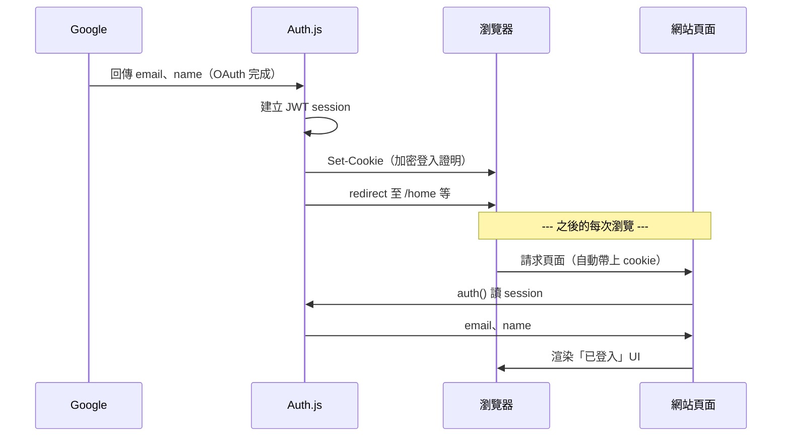

# OAuth 成功後的路徑與 JWT Session（階段 A）

> **文件版本：** 0.2  
> **階段：** 階段 A（SSO 基礎，01～04）  
> **前置：** Google OAuth 憑證已建立（文件 02）  
> **後續實作：** RD 依文件 03 實作

---

## 1. 這份文件做什麼

說明 **Google OAuth 成功之後**，Auth.js 如何讓使用者保持登入狀態（JWT session）。  
不包含學員白名單、建檔、隱私政策（下一階段，文件 05）。

---

## 2. OAuth 成功後發生什麼事？

Google 登入完成後，Google 只會提供一次性的使用者資訊，例如：

- email
- 名字
- 頭像 URL

但網站不能每次開頁面都再叫使用者去 Google 登入。  
因此 Auth.js 會做第二件事：**建立「登入狀態」（session）**，讓使用者接下來一段時間都被視為已登入。

```
Google OAuth 成功
  → Auth.js 拿到 email / name 等
  → 建立 session（「這位使用者已登入」）
  → 瀏覽器收到 cookie
  → 之後每次請求，網站讀 cookie 就知道是誰
```

---

## 3. JWT Session 是什麼？（白話）

### Session 是什麼？

**Session = 網站記住「這個人已經登入過」的機制。**

| 情境 | 行為 |
|------|------|
| 沒有 session | 每次進受保護頁面都要重新 Google 登入 |
| 有 session | 重新整理、切換頁面，仍維持登入，直到登出或過期 |

### JWT Session 是什麼？

Auth.js 預設用 **JWT** 方式保存 session。不必理解 JWT 的數學原理，只要知道運作方式：

1. 登入成功後，Auth.js 把 `{ email, name, ... }` **打包成一段加密的 token**
2. 把 token 放進瀏覽器的 **cookie**
3. 之後每次請求，Auth.js 讀 cookie、解密 token，就知道是誰
4. Server Component 用 `auth()` 讀到的就是 `session.user.email` 等資訊

> **一句話：JWT session = 把登入證明放在 cookie 裡，server 每次解密來看，不用查資料庫。**

### 3.1 ⏭️ 下一階段：token 內還會放條款版本號（⏳ 待確認）

> 本節描述的是 05 §6 的建議機制，**尚未與其他夥伴確認**，可能調整。

階段 A 的 token 只裝 Google 給的身分資訊。**下一階段會多放一個「使用者最新同意的條款版本」**，這是 05 §6 條款改版重簽機制的前提。

原因：條款改版時，手上還有 session 的人不會經過登入頁，必須在**每次請求**攔截。若版本號存在 DB，逐請求檢查就要逐請求查 DB；放進 token 之後，解 token 本來就是每次請求都會做的事，比對等於免費。

```
登入時   jwt callback 把 terms_version 寫進 token
每次請求 proxy 比對 token 內版本 vs 程式中的上線版本常數
        不符 → 導向條款重簽頁
重簽後   寫入 consent_logs，並同步更新 token 內的版本
```

> ⚠️ 最後一步不可省略。重簽後若沒更新 token，下一個請求會再次被攔，形成迴圈。

細節見 [05 §6.3](./05-first-timer-login-flow.md)。

---

## 4. 跟「持久化」有沒有關係？

有關，但要分兩種，不要混在一起：

| 類型 | JWT session（階段 A） | 資料庫（階段 B） |
|------|----------------------|-----------------|
| **持久化什麼** | 「目前是誰登入」 | 學員資料、白名單、隱私政策同意紀錄等 |
| **存在哪** | 瀏覽器 cookie（加密 JWT） | Postgres 等 DB |
| **要不要 DB** | ❌ 不需要 | ✅ 需要 |
| **關掉瀏覽器** | cookie 還在且未過期 → 回來仍登入 | 資料一直在 DB |
| **本階段** | ✅ Auth.js 預設做法 | ❌ 不在本階段 scope |

**重點：**

- JWT session **是**一種「登入狀態的保存」（存在 cookie）
- JWT session **不會**幫你存學員表、白名單等**業務資料**
- 階段 A：只有 JWT session，沒有業務 DB → 合理且足夠
- 階段 B：才需要 DB 存學員、查白名單（見 05）

---

## 5. OAuth 成功後的完整路徑（階段 A）



---

## 6. 相關名詞

| 名詞 | 意思 |
|------|------|
| **callback** | Google 導回 `/api/auth/callback/google` 的那次請求 |
| **JWT session** | 登入狀態放在 cookie，server 解密讀取，不查 DB |
| **cookie** | 瀏覽器替網站保存的資料，之後請求會自動帶上 |
| **`auth()`** | Server Component 用來讀「現在是誰登入」的函式 |
| **登出** | 清除 cookie / session，下次需重新 Google 登入 |

---

## 7. 分工：Tech Lead vs RD

### Tech Lead（Console / 驗收）

- OAuth 憑證、redirect URI 設定正確
- 理解：OAuth 成功後還有 session 這一步
- 驗收：登入後 refresh 仍登入、登出後無法進受保護頁

### RD（Auth.js 實作）

- 安裝 Auth.js、設定 Google Provider
- callback Route Handler
- `auth()`、`signIn()`、`signOut()`
- Middleware 保護路由
- env：`AUTH_SECRET`、`AUTH_GOOGLE_ID`、`AUTH_GOOGLE_SECRET`、`AUTH_URL`

---

## 8. 階段 A 驗收 Checklist

- [ ] Google 登入成功，導回 app
- [ ] 頁面顯示使用者 name / email
- [ ] 重新整理後仍維持登入
- [ ] 登出後 session 清除
- [ ] 登出後無法存取受保護頁面

---

## 9. 修訂紀錄

| 版本 | 日期 | 變更 |
|------|------|------|
| 0.1 | 2026-08-13 | 初稿 |
| 0.2 | 2026-08-21 | 新增 §3.1：下一階段 token 內須放條款版本號（05 §6 重簽機制的前提），含重簽後更新 token 的提醒；該機制標為待確認 |
